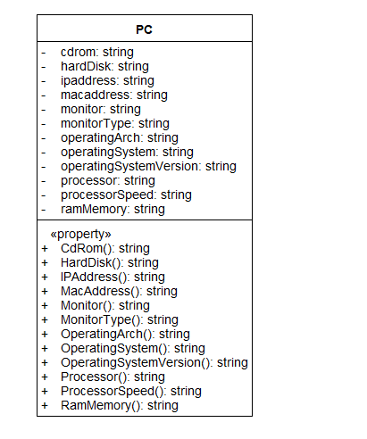
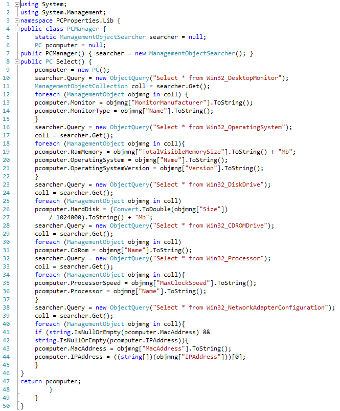
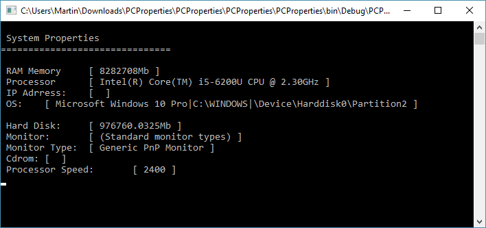
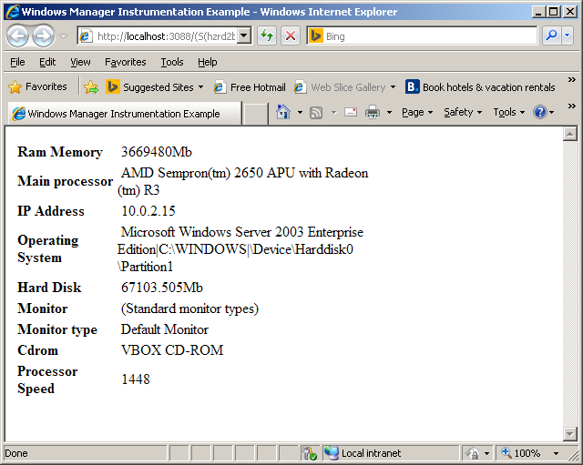

# Utilizando Windows Management Instrumentation (WMI) con Microsoft .NET

Para las aplicaciones que necesiten implementar una solución de un inventario total o parcial del hardware de la computadora, existe una interfaz de programación llamada WMI (Windows Management Instrumentation) a la cual puede accederse mediante lenguajes scripting como VBScript, Perl,Power Shell o cualquier lenguaje diseñado para el .NET Framework que haga uso de los ensamblados System.Management y System.Management.Instrumentation respectivamente.

Windows Management Instrumentation (WMI) es un conjunto de extensiones del Modelo de drivers de Windows WDM (Windows Driver Model) que es un modelo uniforme de clases que representan los valores del hardware y sistema operativo de la computadora,WMI es además la implementación Microsoft de Web-Based Enterprise Management (WBEM) un estándar de la industria que agrupa tecnologías desarrolladas para unificar la administración de los ambientes de computo, por lo que WMI es compatible con WBEM y provee el soporte para el Common Information Model (CIM) que es el modelo que describe los objetos de administración.

Un inventario de hardware con WMI se realiza mediante búsquedas en el repositorio o base de datos de WMI utilizando un lenguaje de consultas conocido como WQL (WMI Query Language) para encontrar los valores de ciertas propiedades del Hardware. WQL es un subconjunto de SQL.

WMI trabaja dentro del contexto de un ensamblado, siendo el predeterminado root\cli que controla las propiedades y métodos que están disponibles en WMI, la seguridad para el WMI se configura a través del control WMI (wmimgmt.msc), de forma predeterminada los usuarios tienen permisos para consultar el proveedor WMI en una computadora local mediante el comando WMIC, desde la línea de comandos del command prompt.

A continuación las clases de un proyecto de consola que imprime información del hardware del equipo.

1-.Una clase PC que será el objeto de transporte

2-.Una clase PCManager que obtendrá algunos de los valores del Hardware para este ejemplo, mediante consultas WQL del repositorio WMI similar a las consultas SQL para en base de datos.

El resultado de la ejecución del programa se muestra en la siguiente imagen:

Los puntos claves del programa utilizados por la clase PCManager son
<ol>
<li>Utilizar los ensamblados <b>System.Management</b> y <b>System.Management.Instrumentation</b>.</li>
<li>Crear una instancia de la clase <b>ManagementObjectSearcher</b></li>
<li>Encapsular cada consulta dentro de la clase <b>ObjectQuery</b></li>
<li>Obtener los resultados de la búsqueda en una colección de ManagementObject representada por la clase ManagementObjectCollection, para iterar dentro de la colección e imprimir los valores.</i>
</ol>

También se puede mostrar información desde una página ASP.NET como en el siguiente screenshot:

El resultado de la ejecucción de la página:

